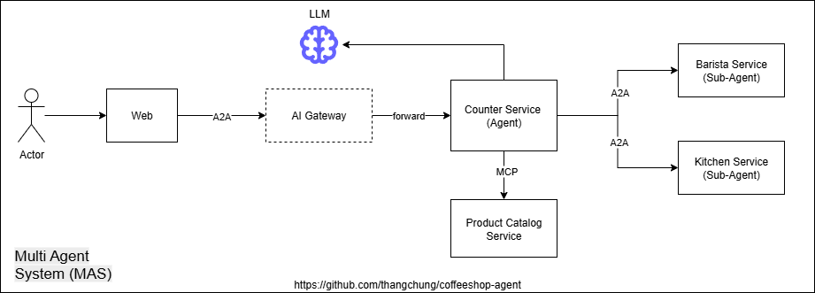
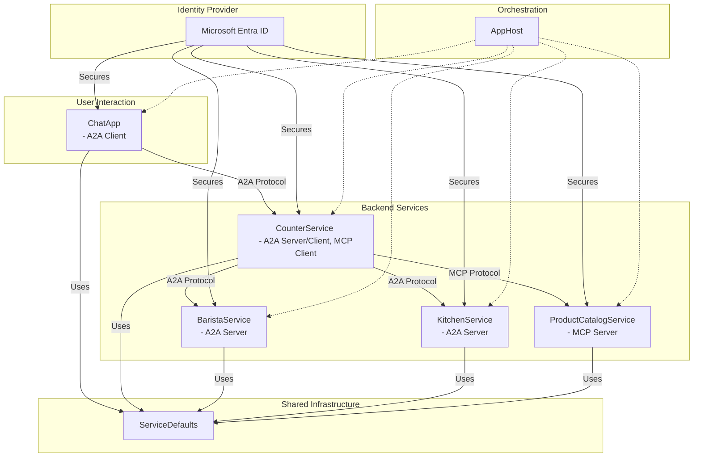

# coffeeshop-agent
.NET Agents technologies



> This is a demonstration application. Certain scenarios presented may be unrealistic or not suitable for real-world use. Please do not replicate or deploy this in a production environment.

## High level architecture



## Get starting

```
dotnet run
```

Access to .NET Aspire dashboard, then open the web, and from the chat box type:

```
a black coffee pls
```

```
I want a black coffee, cappuccino, latte, 2 chicken meat balls and 2 cake pops.
```

## MCP

```
npx @modelcontextprotocol/inspector
```

```
http://localhost:5001/mcp/sse
```

```
http://localhost:5001/.well-known/oauth-protected-resource
```

## A2A

```sh
$Env:GEMINI_API_KEY = '<key>'; agentgateway -f .\agentgateway\config.yaml
```

```
http://localhost:5000/.well-known/agent.json
```

## TODO

- [ ] Semantic Caching with Semantic Kernel: https://share.google/aimode/gxqpWpfekktrOidbr
- [ ] Microsoft.Extensions.AI + Ollama: https://learn.microsoft.com/en-us/dotnet/ai/microsoft-extensions-ai#tool-calling

## References

- https://github.com/thangchung/practical-dotnet-aspire
- https://github.com/thangchung/mcp-labs/blob/feat/a2a_mcp_auth/a2a_mcp_auth_dotnet
- https://devblogs.microsoft.com/foundry/building-ai-agents-a2a-dotnet-sdk/
- https://devblogs.microsoft.com/dotnet/build-a-model-context-protocol-mcp-server-in-csharp/
- https://devblogs.microsoft.com/dotnet/announcing-dotnet-ai-template-preview1/
